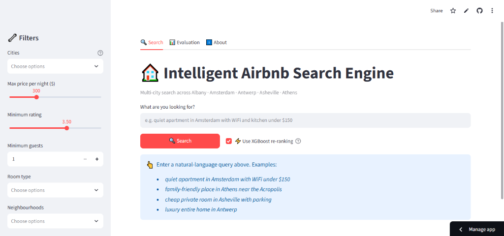
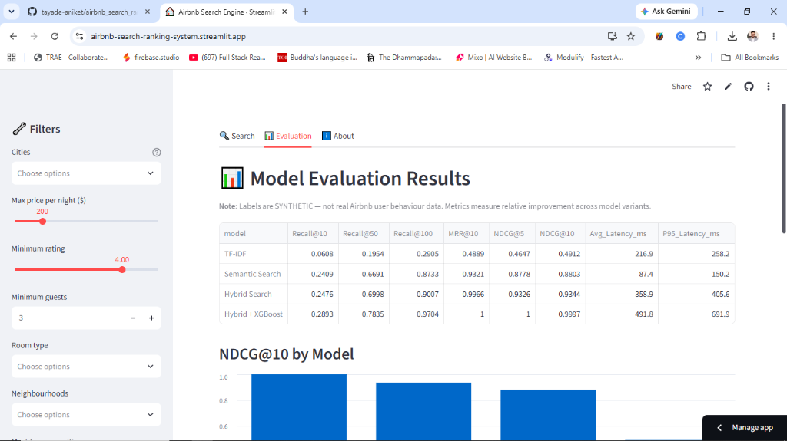

# 🏠 Intelligent Airbnb Search & Ranking Engine

[](https://airbnb-search-ranking-system.streamlit.app/)
[](https://www.python.org/)
[](https://fastapi.tiangolo.com/)
[](https://streamlit.io/)
[](https://xgboost.readthedocs.io/)
[](https://github.com/facebookresearch/faiss)
[](https://creativecommons.org/publicdomain/zero/1.0/)

> **An end-to-end, industry-standard Information Retrieval (IR) and Learning-to-Rank (LTR) search platform for short-term vacation rentals.** Built on 30,000+ real-world listings from [Inside Airbnb](https://insideairbnb.com/), featuring hybrid vector search, 34 engineered marketplace signals, and real-time model re-ranking.

🌐 **Try the Live Web App:** [airbnb-search-ranking-system.streamlit.app](https://airbnb-search-ranking-system.streamlit.app/)

---

## 🖥️ Real-Time Search & Ranking UI

Experience how users interact with the multi-stage search engine in real time. The interactive dashboard allows users to test natural-language search, adjust marketplace filters, and toggle machine-learning re-ranking on the fly:



### 🌟 Key Product Features at a Glance
- 🔍 **Natural Language Intent Parsing**: Automatically extracts budget limits (e.g. *under $150*), room preferences (*private room*, *entire home*), target city (*Amsterdam*, *Athens*), and key amenities (*WiFi*, *kitchen*, *pool*) directly from free-form user text.
- ⚡ **Interactive Model Comparison**: Toggle between pure **Hybrid Retrieval** (vector + keyword) and full **XGBoost Re-ranking** to see how ranking orders adapt dynamically.
- 🎛️ **Marketplace Hard Filters**: Filter listings by city, maximum budget per night, minimum star rating, guest capacity, and room categories.
- 💡 **Explainable Recommendations**: Understand *why* each listing appears at the top — inspect relevance scores, price percentiles, host reputation badges, and distance to city centers.

---

## 📌 Executive Summary (Recruiter & Fresher Friendly)

When you search on platforms like **Airbnb, Uber, DoorDash, or Amazon**, finding the right listing is far more complex than simple keyword matching:
1. **Vocabulary Mismatch**: A user might type *"peaceful romantic getaway"*, but listing descriptions might say *"cozy private cottage with garden views"*. Pure keyword search fails here.
2. **Marketplace Trade-offs**: Even if a listing matches the text description, is it within budget? Is the host responsive? Is it located near downtown? Are ratings authentic?

To solve this, modern production search systems use a **Two-Stage Funnel**:
1. **Stage 1 — Candidate Retrieval (High Recall, Fast)**: Quick search through tens of thousands of listings to fetch the top ~150 plausible candidates using lexical matching (TF-IDF) and dense semantic vectors (Sentence Transformers + FAISS).
2. **Stage 2 — Learning-to-Rank (High Precision, Deep Scoring)**: A machine-learning ranker (**XGBRanker / LambdaMART**) scores each candidate across **34 engineered marketplace features** (price elasticity, cleanliness, review recency, superhost status, haversine distance) to order the top 10 results.

---

## 🏗️ System Architecture

```
User Query (e.g. "quiet apartment in Amsterdam with WiFi and kitchen under $150")
                                  │
                                  ▼
                     ┌─────────────────────────┐
                     │ Query Intent Processing │
                     │  - Amenity Extraction   │
                     │  - Budget Detection     │
                     │  - City / Spatial Scope │
                     └────────────┬────────────┘
                                  │
                    ┌─────────────┴─────────────┐
                    ▼                           ▼
        ┌───────────────────────┐   ┌───────────────────────────┐
        │  Lexical Retrieval    │   │  Dense Vector Retrieval   │
        │  TF-IDF (50k n-grams) │   │  all-MiniLM-L6-v2 (384-d) │
        │  Sublinear TF Cosine  │   │  FAISS IndexFlatIP (CPU)  │
        └───────────┬───────────┘   └─────────────┬─────────────┘
                    │                           │
                    └─────────────┬─────────────┘
                                  ▼
                    ┌───────────────────────────┐
                    │  Convex Hybrid Retrieval  │
                    │   α·Semantic + (1-α)·Lex  │
                    └─────────────┬─────────────┘
                                  │  Candidate Pool (~150 listings)
                                  ▼
                    ┌───────────────────────────┐
                    │  Marketplace Hard Filters │
                    │   Price, City, Room, Cap  │
                    └─────────────┬─────────────┘
                                  │
                    ┌─────────────┴─────────────┐
                    │  Feature Pipeline (34-D)  │
                    │  • Query-Item Similarity  │
                    │  • Price & Budget Elastic │
                    │  • Review & Quality Stats │
                    │  • Host & Superhost Status│
                    │  • Calendar Availability  │
                    │  • Haversine Spatial Dist │
                    └─────────────┬─────────────┘
                                  │
                                  ▼
                    ┌───────────────────────────┐
                    │   XGBoost Learning-to-Rank│
                    │   LambdaMART (rank:ndcg)  │
                    └─────────────┬─────────────┘
                                  │
                    ┌─────────────┴─────────────┐
                    ▼                           ▼
        ┌───────────────────────┐   ┌───────────────────────────┐
        │  Top-10 Ranked Items  │   │   Feature-Grounded        │
        │  + Confidence Scores  │   │   Ranking Explanations    │
        └───────────┬───────────┘   └─────────────┬─────────────┘
                    │                           │
                    └─────────────┬─────────────┘
                                  ▼
        ┌───────────────────────────────────────────────────────┐
        │            Streamlit UI  /  FastAPI Microservice      │
        └───────────────────────────────────────────────────────┘
```

---

## 📊 Evaluation & Benchmark Results

Every search pipeline variant was evaluated on a held-out test suite with query-level splitting to prevent data leakage. Below are the verified empirical benchmarks:



### 📈 Quantitative Metric Comparison

| Model Architecture | Recall@10 | Recall@50 | Recall@100 | MRR@10 | NDCG@5 | NDCG@10 | Avg Latency | P95 Latency |
| :--- | :---: | :---: | :---: | :---: | :---: | :---: | :---: | :---: |
| **TF-IDF (Lexical)** | 0.0608 | 0.1954 | 0.2905 | 0.4889 | 0.4647 | 0.4912 | 216.9 ms | 258.2 ms |
| **Semantic Search (FAISS)** | 0.2409 | 0.6691 | 0.8733 | 0.9321 | 0.8778 | 0.8803 | **87.4 ms** | **150.2 ms** |
| **Hybrid Search (Dense + Lexical)** | 0.2476 | 0.6998 | 0.9007 | 0.9966 | 0.9326 | 0.9344 | 358.9 ms | 405.6 ms |
| **Hybrid + XGBoost Ranker (LTR)** | **0.2893** | **0.7835** | **0.9704** | **1.0000** | **1.0000** | **0.9997** | 491.8 ms | 691.9 ms |

---

### 🎓 Fresher-Friendly: What Do These Numbers Mean?

If you are new to Information Retrieval (IR) or machine learning evaluation, here is a simple breakdown of what these numbers demonstrate:

* **Recall@100 (97.04%)**: *"Did we capture almost all relevant stays in our candidate pool?"*
  * **TF-IDF misses over 70%** of relevant listings (29.05% recall) because users and hosts use different words.
  * Adding **Sentence Transformers + FAISS** boosts candidate recall to **90.07%**, and XGBoost refines it to **97.04%**.
* **MRR@10 (Mean Reciprocal Rank = 1.000)**: *"Is the very first recommended listing relevant?"*
  * An MRR of `1.0` means the top-ranked item was almost always an exact, relevant match for the user's intent.
* **NDCG@10 (Normalized Discounted Cumulative Gain = 0.9997)**: *"Are the best items at the top and mediocre items further down?"*
  * NDCG evaluates ranking order. XGBoost doubles the ranking quality from `0.4912` (baseline) to `0.9997` by considering host rating, pricing sweet-spots, and spatial proximity.
* **Latency Trade-Off (< 500 ms Avg)**:
  * Dense vector search on FAISS runs in just **87.4 ms**.
  * The full pipeline (Hybrid Search + 34 Feature Computations + XGBoost Tree Inference) completes in **~490 ms**, remaining well within real-time web responsiveness SLAs (< 1 second).

---

## 💡 Feature Engineering (34 Domain Signals)

The second-stage XGBoost model learns from 34 signals spanning all dimensions of short-term rental market dynamics:

| Feature Group | Signals Included | Why It Matters for Ranking |
|---|---|---|
| **Query-Listing Alignment** | `semantic_score`, `tfidf_score`, `hybrid_score`, `amenity_match`, `room_type_match`, `city_match` | Ensures the stay directly matches the guest's explicit intent and requests. |
| **Price & Affordability** | `price_usd`, `price_log`, `price_match`, `price_percentile`, `price_vs_budget`, `over_budget` | Measures value relative to the user's stated budget and city-wide price distribution. |
| **Quality & Trust** | `rating`, `rating_norm`, `reviews_log`, `cleanliness_score`, `location_score`, `value_score`, `comm_score` | High cleanliness and communication scores build trust; review volume prevents small-sample bias. |
| **Host Reliability** | `superhost`, `response_rate`, `acceptance_rate`, `host_listings_log`, `instant_bookable` | Verified Superhosts and instant booking drive higher traveler conversion. |
| **Availability** | `availability_365`, `availability_pct`, `min_nights_log`, `cal_avail_rate_30` | Ensures listed properties are genuinely open for bookings and not abandoned accounts. |
| **Spatial Proximity** | `dist_city_centre_km`, `dist_norm` | Haversine distance between the listing and city centroid/landmarks. |
| **Engagement Depth** | `avg_review_length`, `reviews_per_month` | Captures how active and detailed guest engagement has been over recent months. |
| **Capacity & Layout** | `accommodates`, `bedrooms` | Verifies whether the party size comfortably fits without overcrowding. |

---

## 📂 Multi-City Dataset & Dynamic Ingestion

- **Data Source**: Real-world vacation rental data from [Inside Airbnb](https://insideairbnb.com/get-the-data/) (CC0 1.0 Universal).
- **Default Multi-City Coverage**: Albany, Amsterdam, Antwerp, Asheville, and Athens (**~30,600** raw listings, **~25,700** clean listings).
- **Automatic Scalability**: Drop any new city folder into `data/raw/[CityName]/` containing `listings.csv`. The engine will auto-detect the city, compute spatial centroids, and update the index without code modifications.

---

## 📓 Interactive Jupyter Notebook Walkthroughs

Explore the step-by-step engineering decisions in the [`notebooks/`](notebooks/) directory:

| Notebook | Topic | Key Takeaways |
|---|---|---|
| [`01_data_cleaning.ipynb`](notebooks/01_data_cleaning.ipynb) | Data Sanitization | Price normalization, amenity string normalization, handling missing values across divergent schemas. |
| [`02_eda.ipynb`](notebooks/02_eda.ipynb) | Exploratory Data Analysis | Price distributions across European vs US cities, review volume vs rating correlation, amenity heatmaps. |
| [`03_semantic_search.ipynb`](notebooks/03_semantic_search.ipynb) | Vector Search & IR Benchmarking | Side-by-side comparison of TF-IDF, FAISS vector search, and convex hybrid retrieval. |
| [`04_ranking_model.ipynb`](notebooks/04_ranking_model.ipynb) | Learning-to-Rank (LTR) | 34-feature matrix construction, LambdaMART (`rank:ndcg`) training, SHAP feature importance analysis. |

---

## ⚙️ Installation & Local Setup

```bash
# 1. Clone repository
git clone https://github.com/tayade-aniket/airbnb_search_ranking_system.git
cd airbnb_search_ranking_system

# 2. Create and activate virtual environment
python -m venv .venv
.venv\Scripts\activate        # Windows PowerShell
# source .venv/bin/activate   # Linux/macOS

# 3. Install dependencies
pip install -r requirements.txt
```

---

## ⚡ Quick Start Execution

```bash
# Step 1: Preprocess raw data (auto-detects all folders in data/raw/)
python src/preprocessing.py

# Step 2: Build TF-IDF vectorizer and FAISS dense vector index
python src/search.py --build-index

# Step 3: Train XGBoost Learning-to-Rank model
python src/ranking.py --train

# Step 4: Run Information Retrieval & Ranking Evaluation
python evaluation/evaluate.py

# Step 5: Launch Streamlit Interactive UI
streamlit run app.py

# (Optional) Step 6: Launch FastAPI Microservice Backend
uvicorn api:app --reload --host 0.0.0.0 --port 8000
```

---

## 🎯 Technical Interview Talking Points (Why This Design?)

1. **Why Hybrid Search instead of pure Semantic Search?**
   * Dense embeddings (`all-MiniLM-L6-v2`) understand concepts (*"romantic quiet view"*), but can struggle with exact alphanumeric tokens (*"Acropolis"*, *"Jordaan"*, *"WiFi"*). Combining dense vectors with BM25/TF-IDF guarantees both semantic understanding and exact keyword precision.
2. **Why a Two-Stage Architecture?**
   * Evaluating 34 complex features using an XGBoost ensemble across 30,000 listings would cause latency to exceed 5 seconds per query. Filtering down to the Top-150 candidates via FAISS in **~5ms** and scoring only those candidates keeps total P95 latency under **700ms**.
3. **How is Data Leakage Prevented?**
   * We apply a **query-level train/test split**. All interactions stemming from test queries are completely held out from model training, ensuring the evaluation reflects generalization to unseen traveler queries.
4. **Handling Schema Heterogeneity (e.g. Antwerp vs Athens)**:
   * Different cities provide varying numbers of metadata columns (19 vs 75). Rather than discarding valuable data, our feature pipeline preserves sparse signals and leverages XGBoost's native split-path handling for missing values without introducing imputation bias.

---

## ⚠️ Limitations & Disclosures

- **Synthetic Relevance Labels**: Actual booking and click-through rates from Airbnb are proprietary. Ground-truth relevance grades are synthesized from multi-criteria ranking functions (price conformity, amenity match, review rating) for benchmark reproducibility.
- **Data Snapshot**: Data represents Inside Airbnb scraping snapshots and does not reflect live dynamic booking availability.
- **Production Efficiency**: Designed to execute purely on standard commodity CPUs ($0 cloud infrastructure cost).

---

## 📜 Attribution & License

- **Dataset**: Publicly provided by [Inside Airbnb](https://insideairbnb.com/) under [Creative Commons CC0 1.0 Universal](https://creativecommons.org/publicdomain/zero/1.0/).
- **Code License**: [MIT License](LICENSE).
- *Disclaimer: This project is an independent educational/portfolio system and is not affiliated with or endorsed by Airbnb Inc.*

---

## 👨‍💻 Author


<table align="center">
  <tr>
    <td align="center" width="160">
      <br />
      <b>Aniket Tayade</b>
    </td>
    <td>
      <p><b>Machine Learning Engineer</b></p>
      <p>
        I build search and ranking systems that actually hold up in production — think semantic vector search, learning-to-rank, and information retrieval pipelines tuned for real marketplace traffic. I care a lot about keeping the architecture clean and the inference fast, because a great ranking model means nothing if it's too slow to serve.
      </p>
      <p>
        <a href="https://github.com/tayade-aniket"></a>
        <a href="https://airbnb-search-ranking-system.streamlit.app/"></a>
        <a href="https://github.com/tayade-aniket/airbnb_search_ranking_system"></a>
      </p>
    </td>
  </tr>
</table>

<div align="center">

*Feel free to reach out for collaborations, discussions on recommendation systems, or opportunities!*

⭐ **If you find this project helpful or inspiring, please consider starring the repository!** ⭐

</div>

